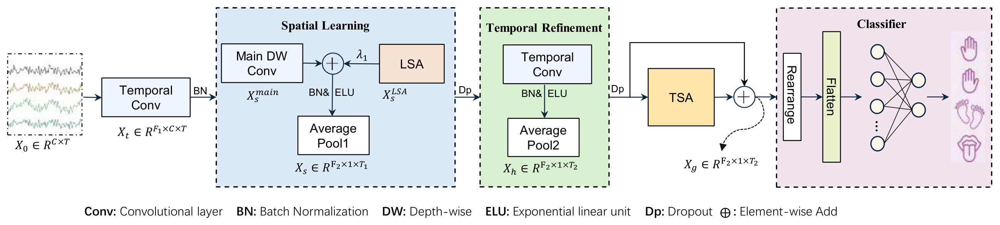
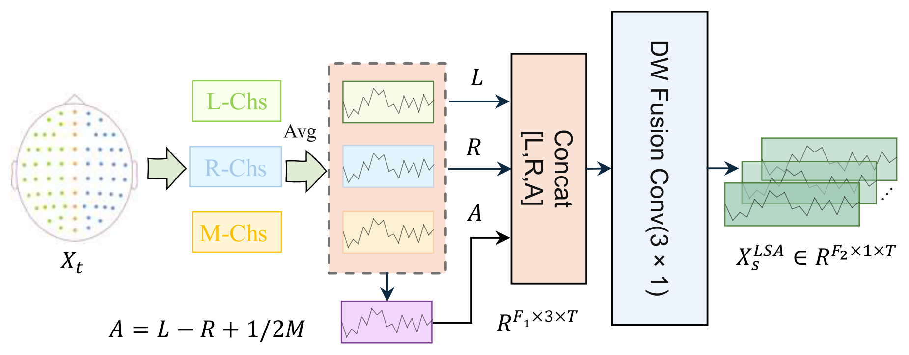
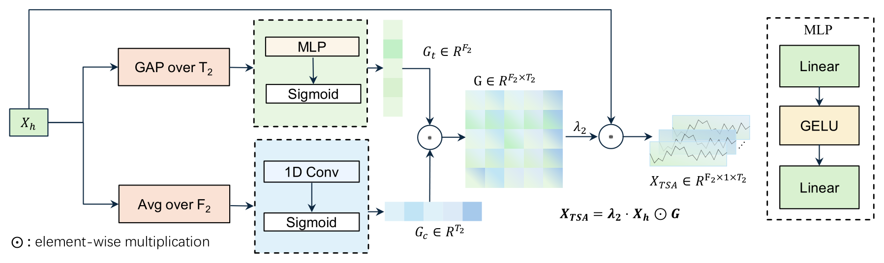
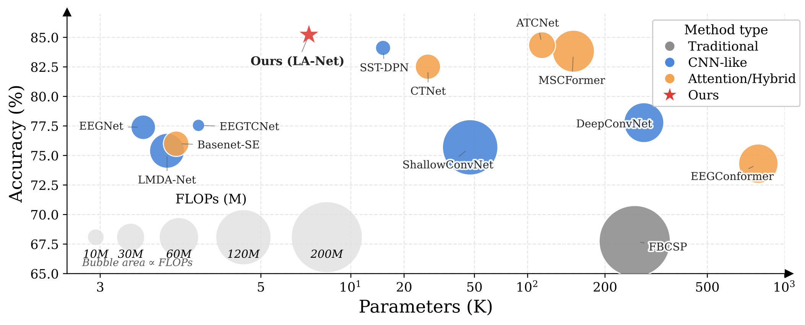
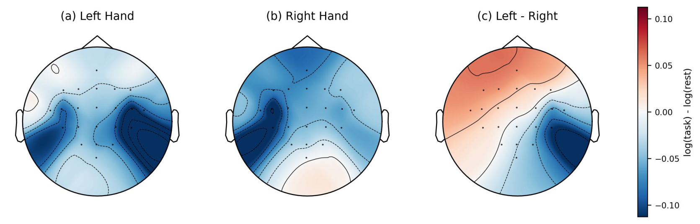
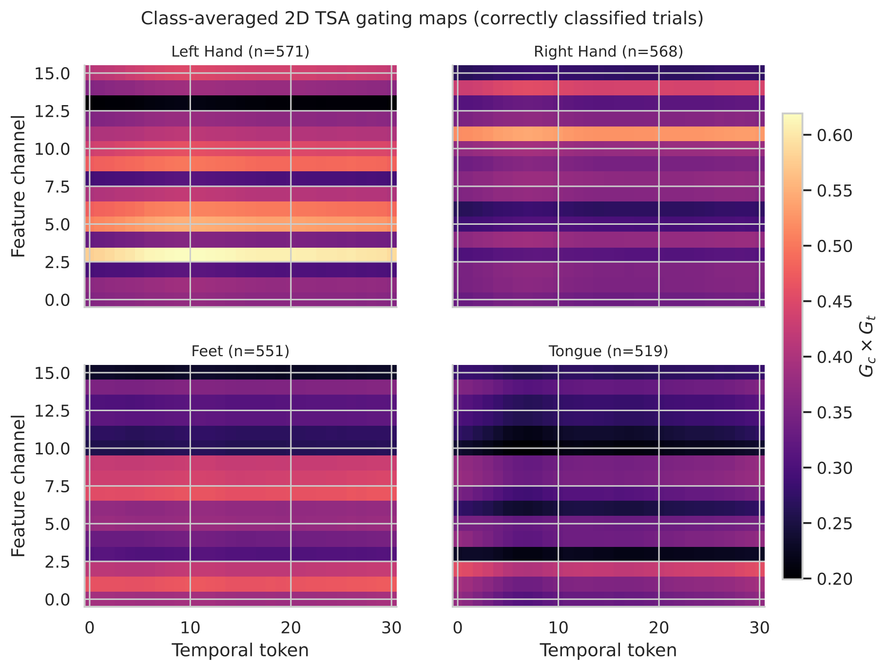
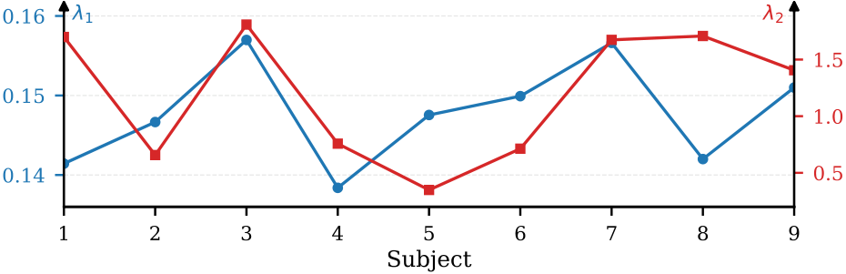

# LA-Net

Official minimal release of **LA-Net** for EEG-based motor imagery decoding on **BCI Competition IV-2a** and **BCI Competition IV-2b**.

This repository is intentionally narrow:

- one public model family: `LANet`
- one public spatial prior module: `LSAModule`
- one public temporal-spatial attention module: `TSAModule`
- four official configs
- four official weight groups
- official raw-data preparation scripts for `mymat_a` / `mymat_b`

It does **not** include the private experiment zoo, auxiliary baselines, or unpublished branches.

## Overview

**LA-Net: A Lateralized Asymmetry Network for Motor Imagery EEG Decoding**

LA-Net is a lightweight decoding network built around two components:

- **LSA-Module (Lateralized Spatial Asymmetry)** — extends spatial representation through explicit hemispheric-difference modeling with midline compensation. It constructs left-hemisphere, right-hemisphere, and midline mean responses from the raw electrodes and fuses the hemispheric difference term back into the main spatial branch via a learnable additive coefficient, embedding lateralization neurophysiology directly into the spatial stage.
- **TSA-Module (Temporal-Spatial Attention)** — recalibrates high-level representations via joint temporal-channel gating. It produces a residual-enhanced feature through combined temporal and channel gates with minimal parameter overhead.

On BCI IV-2a and IV-2b, LA-Net reaches average accuracies of **85.22%** and **89.15%** (subject-dependent) and **62.69%** and **76.92%** (LOSO), ranking first among the compared baselines under both protocols while using only **7.24K parameters**.

### Architecture



The backbone follows an EEGNet-style "time-first, space-second" decomposition with three stages: temporal convolution, channel depth-wise spatial convolution, and temporal refinement convolution. The LSA branch operates in parallel with the main spatial branch and is merged by learnable additive fusion; the TSA-Module then applies joint temporal-channel gating to the high-level representation before classification.

| LSA-Module | TSA-Module |
| :---: | :---: |
|  |  |

## Main results

All numbers below are averaged over 9 subjects (mean ± std). Accuracy (%) and Cohen's kappa are reported.

### Subject-dependent

Subject-dependent performance comparison on BCI IV-2a and BCI IV-2b:

| Model | 2a Acc ± Std (%) | 2a κ ± Std | 2b Acc ± Std (%) | 2b κ ± Std |
| :--- | :---: | :---: | :---: | :---: |
| DeepConvNet | 77.78 ± 14.42 | 0.7037 ± 0.1923 | 85.21 ± 9.56 | 0.7042 ± 0.1912 |
| EEGNet | 77.39 ± 12.47 | 0.6986 ± 0.1663 | 87.71 ± 9.33 | 0.7542 ± 0.1866 |
| EEGTCNet | 77.55 ± 13.07 | 0.7006 ± 0.1743 | 87.18 ± 9.51 | 0.7437 ± 0.1902 |
| LMDA-Net | 75.40 ± 13.56 | 0.6700 ± 0.1808 | 82.51 ± 12.28 | 0.6500 ± 0.2456 |
| EEGConformer | 74.31 ± 15.18 | 0.6574 ± 0.2024 | 83.75 ± 9.82 | 0.6750 ± 0.1964 |
| ATCNet | 84.34 ± 8.78 | 0.7912 ± 0.1171 | 86.64 ± 10.15 | 0.7328 ± 0.2030 |
| MSCFormer | 83.83 ± 9.38 | 0.7845 ± 0.1251 | 86.92 ± 9.61 | 0.7385 ± 0.1922 |
| CTNet | 82.52 ± 9.61 | 0.7670 ± 0.1281 | 88.49 ± 9.03 | 0.7697 ± 0.1806 |
| **LA-Net (ours)** | **85.22 ± 7.96** | **0.8030 ± 0.1061** | **89.15 ± 8.74** | **0.7830 ± 0.1748** |

### LOSO (leave-one-subject-out)

LOSO performance comparison on BCI IV-2a and BCI IV-2b:

| Model | 2a Acc ± Std (%) | 2a κ ± Std | 2b Acc ± Std (%) | 2b κ ± Std |
| :--- | :---: | :---: | :---: | :---: |
| DeepConvNet | 60.15 ± 12.71 | 0.4686 ± 0.1695 | 75.18 ± 6.84 | 0.5037 ± 0.1368 |
| EEGNet | 56.85 ± 15.82 | 0.4246 ± 0.2109 | 75.13 ± 6.35 | 0.5026 ± 0.1270 |
| EEGTCNet | 58.68 ± 14.90 | 0.4491 ± 0.1987 | 75.00 ± 6.04 | 0.5000 ± 0.1208 |
| EEGConformer | 53.41 ± 17.08 | 0.3789 ± 0.2277 | 73.52 ± 6.96 | 0.4703 ± 0.1392 |
| ATCNet | 62.06 ± 13.35 | 0.4941 ± 0.1780 | 75.82 ± 4.80 | 0.5163 ± 0.0960 |
| CTNet | 58.64 ± 14.61 | 0.4486 ± 0.1948 | 76.27 ± 5.26 | 0.5252 ± 0.1052 |
| MSCFormer | 59.24 ± 13.34 | 0.4565 ± 0.1779 | 75.97 ± 6.75 | 0.5193 ± 0.1350 |
| **LA-Net (ours)** | **62.69 ± 14.06** | **0.5026 ± 0.1875** | **76.92 ± 5.81** | **0.5385 ± 0.1162** |

### Model complexity

Computational cost and recognition performance on BCI IV-2a. FLOPs may vary slightly across toolchains, so the table is best viewed as a relative complexity comparison:

| Model | Acc (%) | Params (K) | FLOPs (M) |
| :--- | :---: | :---: | :---: |
| DeepConvNet | 77.78 | 283.23 | 65.63 |
| EEGNet | 77.39 | **3.44** | 25.07 |
| EEGTCNet | 77.55 | 4.10 | **6.48** |
| LMDA-Net | 75.40 | 3.71 | 50.38 |
| EEGConformer | 74.31 | 789.57 | 63.86 |
| ATCNet | 84.34 | 113.73 | 29.81 |
| MSCFormer | 83.83 | 150.72 | 72.69 |
| CTNet | 82.52 | 27.28 | 26.39 |
| **LA-Net (ours)** | **85.22** | 7.24 | 26.96 |



### Ablation study

Ablation under the subject-dependent protocol. `G_c` = channel gate, `G_t` = temporal gate of the TSA-Module:

| Model | LSA | G_c | G_t | 2a Acc (%) | 2a κ | 2b Acc (%) | 2b κ |
| :--- | :---: | :---: | :---: | :---: | :---: | :---: | :---: |
| Full model | ✓ | ✓ | ✓ | **85.22** | **0.8030** | **89.15** | **0.7830** |
| w/o LSA | | ✓ | ✓ | 83.26 | 0.7767 | 87.69 | 0.7538 |
| w/o TSA | ✓ | | | 83.22 | 0.7762 | 88.68 | 0.7735 |
| w/o temporal gate | ✓ | ✓ | | 82.37 | 0.7649 | 88.02 | 0.7604 |
| w/o channel gate | ✓ | | ✓ | 81.91 | 0.7587 | 87.70 | 0.7540 |
| w/o LSA + TSA | | | | 82.91 | 0.7721 | 86.74 | 0.7347 |

Removing either module degrades performance, and ablating either TSA sub-gate hurts more than removing the entire TSA block — the temporal and channel gates are most effective when operating jointly.

## Interpretability

Task-rest responses of left- and right-hand MI in the 8–30 Hz sensorimotor band show stable spatially asymmetric patterns over the bilateral sensorimotor cortex, and the difference map highlights the hemispheric lateralization effect. This provides direct physiological grounding for the hemispheric-difference priors built into the LSA-Module:



Per-trial 2D temporal-channel gating maps learned by the TSA-Module illustrate how the model recalibrates discriminative time-channel locations:





## Citation

If you use this code or the released weights, please cite:

```bibtex
@misc{liu2026lanet,
  title     = {LA-Net: A Lateralized Asymmetry Network for Motor Imagery EEG Decoding},
  author    = {Liu, Demei and Gu, Tingting and Shi, Xiaochen and Chen, Zekai and Shi, Aichun and Quan, Yujuan},
  year      = {2026},
  note      = {Preprint}
}
```

Please replace this entry with the final published citation when available.

## Repository layout

```text
LA-Net/
├─ models/
├─ data/
├─ configs/official/
├─ scripts/
├─ weights/
├─ datasets/
│  ├─ mymat_a/
│  └─ mymat_b/
├─ docs/images/        # paper figures used in this README
├─ README.md
├─ DATA_PREPARATION.md
├─ LICENSE
└─ requirements.txt
```

## Environment

Validated environment:

- Python `3.11.14`
- PyTorch `2.5.1`
- CUDA build used in the validated GPU environment: `2.5.1+cu121`

`requirements.txt` now reflects the exact package versions used in the tested public release.

```bash
pip install -r requirements.txt
```

If you prefer Conda, an exact environment file is also provided:

```bash
conda env create -f environment.yml
conda activate LA-Net
```

If you need GPU training or evaluation, replace the default `torch` install with the CUDA wheel that matches your driver and platform.

## Data preparation

The public release provides the official data-preparation workflow for `mymat_a` and `mymat_b`.

Prepare **BCI Competition IV-2a**:

```bash
python scripts/prepare_bcic2a.py \
  --raw_dir /path/to/BCICIV_2a_gdf \
  --label_dir /path/to/true_labels(BCICIV_2a_gdf) \
  --out_dir datasets/mymat_a
```

Prepare **BCI Competition IV-2b**:

```bash
python scripts/prepare_bcic2b.py \
  --raw_dir /path/to/BCICIV_2b_gdf \
  --label_dir /path/to/true_labels(BCICIV_2b_gdf) \
  --out_dir datasets/mymat_b
```

Important:

- they save only `data` and `label`
- the generated caches are directly compatible with the released configs and official weights
- the IV-2b cache has **subject-dependent trial counts** and is not uniformly `400/320`

Details are documented in [DATA_PREPARATION.md](DATA_PREPARATION.md).

The original BCI Competition IV-2a and IV-2b recordings are not included in
this repository. Please obtain them from the official dataset source and
comply with the dataset terms of use. The MIT License in this repository
covers only the original LA-Net code and does not cover the datasets or
third-party dependencies.

## Official configs

- `configs/official/bcic2a_subject_dependent.yaml`
- `configs/official/bcic2a_loso.yaml`
- `configs/official/bcic2b_subject_dependent.yaml`
- `configs/official/bcic2b_loso.yaml`

The official configs include fixed per-subject random seeds to improve reproducibility of the released results. If you want to reproduce the reported `accuracy` and `kappa` as closely as possible, use the provided seeds directly. You can still override them with `--seed` when running your own experiments.

## Training

Example: subject-dependent training on IV-2a subject 1

```bash
python train.py \
  --config configs/official/bcic2a_subject_dependent.yaml \
  --subject 1 \
  --device cuda:0 \
  --num_workers 4
```

Example: LOSO training on IV-2b with target subject 1

```bash
python train.py \
  --config configs/official/bcic2b_loso.yaml \
  --subject 1 \
  --device cuda:0 \
  --num_workers 4
```

## Evaluation

```bash
python eval.py \
  --config configs/official/bcic2a_loso.yaml \
  --checkpoint weights/bcic2a_loso/subject_01.pt \
  --subject 1 \
  --device cuda:0
```

## Weights

The `weights/` directory contains four official result groups:

- `bcic2a_subject_dependent/`
- `bcic2a_loso/`
- `bcic2b_subject_dependent/`
- `bcic2b_loso/`

Each group contains:

- `subject_01.pt` ... `subject_09.pt`
- `config.yaml`
- `metrics.csv`

Each checkpoint is a plain checkpoint dict with `state_dict`, metadata, and the config snapshot used during conversion.

## License

This project is released under the MIT License. See [LICENSE](LICENSE).
PyTorch, MNE, NumPy, SciPy, scikit-learn, pandas, PyYAML, and einops remain
under their respective licenses; consult the corresponding project
documentation for details.
